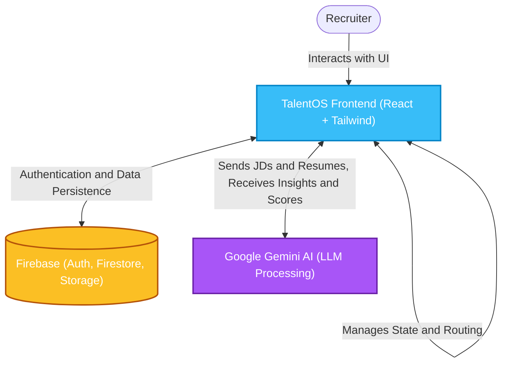
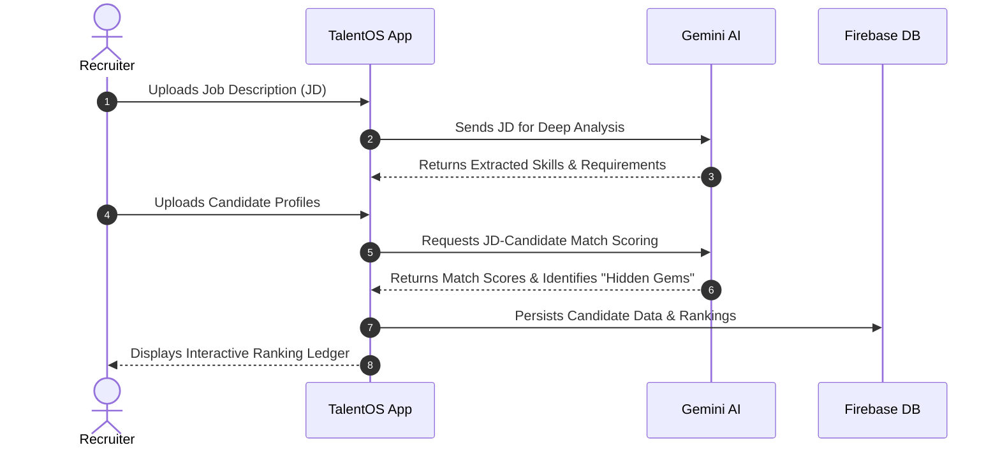

<div align="center">
  <h1>🚀 TalentOS</h1>
  <p><strong>A next-generation, AI-powered talent management and recruiting operating system.</strong></p>
  
  <p>
    
    
    
    
    
    
  </p>
</div>

<br />

## 🌟 Overview

**TalentOS** is a modern, responsive web application designed to streamline and supercharge the recruitment process. By leveraging the advanced reasoning capabilities of **Google's Generative AI (Gemini)** alongside a robust modern frontend stack, TalentOS helps recruiters analyze job descriptions, discover hidden talent gems, and manage candidate pipelines with unparalleled efficiency.

---

## 🏗️ System Architecture

The application follows a modern serverless architecture, integrating directly with Firebase for backend services and Google Gemini for AI capabilities.



---

## 🔄 Core Workflow

Below is the standard workflow of how TalentOS processes recruitment data to provide intelligent insights.



---

## ✨ Key Features

- **📊 Interactive Dashboard**: Get a bird's-eye view of your recruitment pipeline and key metrics with beautiful, responsive charts and lists.
- **📝 JD Analyzer**: Upload or paste job descriptions to automatically extract core requirements, essential skills, and generate intelligent candidate matching criteria.
- **🏆 Candidate Ranking Ledger**: Automatically rank and score candidates based on job fit using advanced natural language processing.
- **💎 Hidden Gems Discovery**: Uncover high-potential candidates who might not fit the traditional mold (e.g., missing specific keywords) but possess highly transferable skills.
- **📋 Shortlists Management**: Organize, track, and manage your curated lists of top candidates effortlessly with drag-and-drop or categorized workflows.

---

## 🛠️ Technology Stack

| Category               | Technology                                                                                                    |
| ---------------------- | ------------------------------------------------------------------------------------------------------------- |
| **Frontend Framework** | [React 18](https://reactjs.org/) + [Vite](https://vitejs.dev/)                                                |
| **Language**           | [TypeScript](https://www.typescriptlang.org/)                                                                 |
| **Styling & UI**       | [Tailwind CSS](https://tailwindcss.com/) & [Framer Motion](https://www.framer.com/motion/)                    |
| **Routing**            | [React Router v6](https://reactrouter.com/)                                                                   |
| **Icons**              | [Lucide React](https://lucide.dev/)                                                                           |
| **Backend / BaaS**     | [Firebase](https://firebase.google.com/)                                                                      |
| **AI Integration**     | [Google Generative AI (Gemini)](https://ai.google.dev/)                                                       |

---

## 🚀 Getting Started

Follow these steps to set up the project locally.

### Prerequisites

- [Node.js](https://nodejs.org/) (version 18 or higher recommended)
- `npm` or `yarn` installed

### Installation

1. **Clone the repository**
   ```bash
   git clone <your-repo-url>
   cd TalentOS
   ```

2. **Install dependencies**
   ```bash
   npm install
   ```

3. **Environment Setup**
   Create a `.env.local` file in the root directory based on the `.env.local.example` file and populate it with your specific credentials:
   ```env
   # Firebase Configuration
   VITE_FIREBASE_API_KEY=your_api_key_here
   VITE_FIREBASE_AUTH_DOMAIN=your_project.firebaseapp.com
   VITE_FIREBASE_PROJECT_ID=your_project_id
   VITE_FIREBASE_STORAGE_BUCKET=your_project.appspot.com
   VITE_FIREBASE_MESSAGING_SENDER_ID=your_sender_id
   VITE_FIREBASE_APP_ID=your_app_id
   
   # Gemini AI Configuration
   VITE_GEMINI_API_KEY=your_gemini_api_key_here
   ```

### Development Server

Start the Vite development server with hot-module replacement (HMR):

```bash
npm run dev
```

Navigate to `http://localhost:5173` in your browser to view the application.

---

## 📦 Building for Production

To create an optimized production build:

```bash
npm run build
```

To preview the compiled production build locally before deploying:

```bash
npm run preview
```

---

## 📄 License

This project is licensed under the [MIT License](LICENSE).
