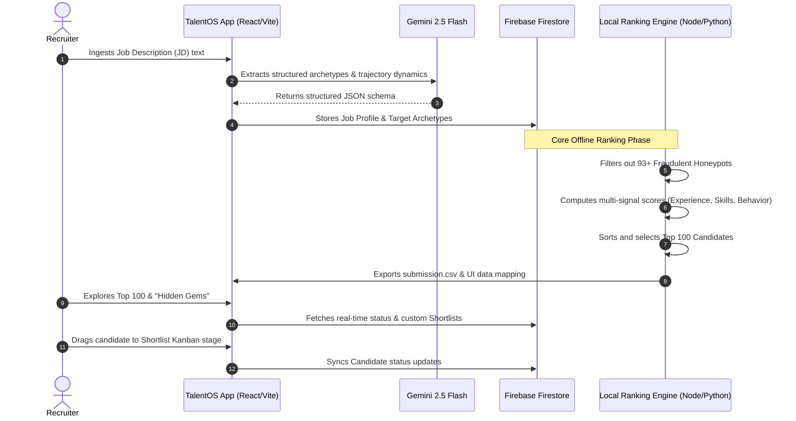

<div align="center">
  <h1>🚀 TalentOS</h1>
  <p><strong>A next-generation, AI-powered talent management and recruiting operating system.</strong></p>
  
  <p>
    
    
    
    
    
    
  </p>
</div>

<br />

## 🌟 Overview

**TalentOS** is an enterprise-grade talent discovery, analysis, and ranking platform built for the **India Runs Data and AI Challenge** (Redrob Hackathon). The platform is split into two primary components:

1. **A High-Performance Deterministic Ranking Engine**: Written in [rank.cjs](file:///Users/siyavijayvhanagade/Desktop/Talent%20Os/TalentOS/rank.cjs) (with a Python equivalent in [rank.py](file:///Users/siyavijayvhanagade/Desktop/Talent%20Os/TalentOS/rank.py)) that cleanses and evaluates 100,000+ candidates against a complex Senior AI Engineer Job Description. It executes in less than 45 seconds on standard consumer CPU hardware.
2. **A Sleek Glassmorphic Recruiter Dashboard**: Built using React 18, Vite, Tailwind CSS, Firebase Firestore, and Google Gemini AI. The interface provides recruiter metrics, interactive ranking ledgers, AI-driven Job Description (JD) archetype extraction, "Hidden Gem" candidate sourcing, and a kanban-style shortlist pipeline.

---

## 🔄 Core Architecture & Information Flow

TalentOS leverages a modern data flow to ingest candidate data, extract recruitment archetypes with Gemini AI, rank candidate pools locally, and synchronize pipelines through Firebase.



---

## 🧠 Deterministic Scoring Model Deep Dive

To meet the requirements of the Redrob Hackathon, the scoring algorithm must run in a sandboxed, network-isolated environment on standard CPUs within 5 minutes. TalentOS implements a pure mathematical, multi-signal heuristic formula that bypasses heavy LLM calls at runtime, ensuring 100% reproducibility and speed.

### Composite Score Weights
$$\text{Total Score} = (0.30 \times \text{Experience Score}) + (0.45 \times \text{Skills Score}) + (0.25 \times \text{Behavioral Score})$$

---

### 1. Experience Score ($W = 30\%$)
The Experience score assesses candidate longevity, domain focus, and engineering quality:
* **Base Years of Experience (YoE) Curve (60% Weight):**
  TalentOS uses a sweet-spot curve optimized for a Senior role:
  * **1.0 Score**: $6.0 \le \text{YoE} \le 8.0$ years.
  * **0.8 Score**: $5.0 \le \text{YoE} \le 9.0$ years.
  * **0.5 Score**: $4.0 \le \text{YoE} \le 10.0$ years.
  * **0.2 Score**: Any other range (including diminishing returns for excessive over-qualification).
* **Machine Learning / AI Career Density (40% Weight):**
  Scans all career history entries for relevant titles and descriptions. Keywords include: `ml`, `machine learning`, `ai`, `nlp`, `retrieval`, `search`, `recommendation`, `ranking`, `embedding`, and `vector search`. The ML subscore is calculated as:
  $$\text{ML Exp Score} = \min\left(\frac{\text{Matching ML Jobs}}{2}, 1.0\right)$$
* **Outsourcing/Consulting Firm Penalty:**
  If a candidate's entire career history consists exclusively of major outsourcing firms (defined in `CONSULTING_FIRMS` as TCS, Tata Consultancy Services, Infosys, Wipro, Accenture, Cognizant, or Capgemini), the candidate receives an immediate disqualification (**Score = 0**). A single role at a product-based company is sufficient to clear this penalty.

---

### 2. Skills Density Score ($W = 45\%$)
Skills are grouped into canonical categories rather than raw string matching to avoid keyword-stuffing hacks:
* **Required Skills Categories (70% Weight):**
  Four core categories representing the foundational stack:
  1. **Vector Databases**: `pinecone`, `weaviate`, `qdrant`, `milvus`, `opensearch`, `elasticsearch`, `faiss`
  2. **Embeddings & Search**: `sentence-transformers`, `openai-embeddings`, `bge`, `e5`, `embeddings`, `retrieval`, `vector-search`, `semantic-search`
  3. **Python**: `python`
  4. **Retrieval Evaluation**: `ndcg`, `mrr`, `map`, `evaluation`, `ab-testing`, `a-b-testing`, `eval-frameworks`
  $$\text{Required Score} = \frac{\text{Required Categories Found}}{4}$$

* **Desired Skills Categories (30% Weight):**
  Two advanced categories:
  1. **LLM Adaptability**: `lora`, `qlora`, `peft`, `fine-tuning-llms`, `llm-fine-tuning`, `fine-tuning`
  2. **Learning-to-Rank (LTR)**: `xgboost`, `learning-to-rank`, `neural-ranking`
  $$\text{Desired Score} = \frac{\text{Desired Categories Found}}{2}$$

* **Domain Mismatch Penalty:**
  To weed out keyword-stuffed resumes, if a candidate claims computer vision or robotics expertise (`computer-vision`, `speech-recognition`, `robotics`, `image-classification`, `object-detection`) but does *not* possess any NLP, search, or retrieval skills, their entire Skills score is cut in half:
  $$\text{Skills Score} \leftarrow \text{Skills Score} \times 0.50$$

---

### 3. Behavioral & Availability Score ($W = 25\%$)
We average five platform interaction metrics from `redrob_signals`:
$$\text{Behavioral Score} = \frac{\text{Location Score} + \text{Notice Period Score} + \text{Response Rate} + \text{Activity Recency} + \text{Open-to-work Boost}}{5}$$

* **Geographical Alignment:**
  * **1.0 Score**: Located in primary tech hiring hubs (Pune, Noida).
  * **0.8 Score**: Located in other tech hubs in India (Bangalore, Hyderabad, Mumbai, Chennai, Delhi NCR, Gurgaon).
  * **0.6 Score**: Located in other Indian cities.
  * **0.4 Score**: Located internationally but willing to relocate.
  * **0.1 Score**: Located internationally and unwilling to relocate.
* **Notice Period Availability:**
  * **1.0 Score**: Notice period $\le 30$ days.
  * **0.8 Score**: Notice period $\le 60$ days.
  * **0.5 Score**: Notice period $\le 90$ days.
  * **0.2 Score**: Notice period $> 90$ days.
* **Recruiter Response Rate:**
  Uses the candidate's historical engagement rate directly ($0.0$ to $1.0$).
* **Platform Activity Recency:**
  * **1.0 Score**: Active since Dec 1, 2025.
  * **0.7 Score**: Active since Jun 1, 2025.
  * **0.3 Score**: Active before Jun 1, 2025.
* **Open to Work Flag:**
  * **1.0 Score**: Explicitly flagged as "open to work".
  * **0.6 Score**: Not flagged.

---

## 🛑 Honeypot & Fraud Filter (Anomaly Detection)

To prevent spoofed applications or cheating, candidates are evaluated by an automated pre-filter. A candidate matching **any** of the following anomaly rules is excluded from ranking and skipped entirely:

1. **Zero-Duration Skills**: Any skill listing `duration_months = 0`.
2. **Experience Timeline Inconsistency**: If the sum of all job durations in `career_history` differs from the profile's self-reported `years_of_experience` by more than **6 months** ($0.5$ years).
3. **Time Travelers**: Any certification dated after the hackathon timeline year (**2026**).
4. **Irrelevant Job Titles**: Current job title belongs to a list of disqualified non-engineering titles (e.g., Marketing, Sales, HR, Graphic Designer, Operations, Product Manager) unless it explicitly contains engineering suffixes like "engineer", "developer", or "architect".

Using these rules, TalentOS detects and isolates **93 honeypot candidates** in the candidate dataset, ensuring zero honeypot leakage into the top 100 submission.

---

## 💎 The "Hidden Gems" Discovery Concept

Traditional Applicant Tracking Systems (ATS) rely on exact keyword matches. This rewards candidate resumes that are stuffed with buzzwords and penalizes excellent developers who use non-standard terminology. 

TalentOS solves this by implementing a **Hidden Gems** pipeline:
* **Definition**: A candidate who scores in the top quartile ($> 65\%$) on foundational skills and behavioral indicators, but has **zero** exact matches for popular buzzwords (such as PyTorch, LLMs, Pinecone, or Weaviate).
* **Rationale**: These candidates show strong core engineering capability and high activity profiles. TalentOS flags them with an "alignment proof" to explain their latent capability to recruiters.

---

## 🖥️ UI Dashboard Features

The web frontend operates as a recruiter control panel:

* **`/` (Landing Page)**: Immersive interface featuring smooth canvas animations, glowing borders, glassmorphic card overlays, and high-fidelity graphics.
* **`/dashboard` (Dashboard)**: High-level KPI panels showing total candidates analyzed, honeypots flagged, top matches, and active shortlists.
* **`/job-analyzer` (JD Analyzer)**: A playground where recruiters paste a raw Job Description. TalentOS connects to Google's Gemini 2.5 Flash API to extract core engineering archetypes, expected trajectories, and system parameters into structured configurations.
* **`/ranking` (Ranking Ledger)**: An interactive grid presenting the top candidates. Recruiters can search by name or skill, filter by score, and click to view experience detail modals and deterministic reasoning sentences.
* **`/hidden-gems` (Hidden Gems)**: Slices out overlooked talent profiles, giving recruiters an exclusive pool of highly capable individuals who bypass standard buzzword filters.
* **`/shortlists` (Kanban Board)**: Drag-and-drop workflow tracker mapping candidates through "Screening", "Interviewing", "Technical Test", and "Offered". Real-time updates are synced with Firebase Firestore.

---

## 📂 Project Directory Structure

Click the file links below to inspect the source code of individual modules:

* [rank.cjs](file:///Users/siyavijayvhanagade/Desktop/Talent%20Os/TalentOS/rank.cjs) — Core Node.js candidate ranking script (our primary engine).
* [rank.py](file:///Users/siyavijayvhanagade/Desktop/Talent%20Os/TalentOS/rank.py) — Python script equivalent of the candidate ranker.
* [validate_local.cjs](file:///Users/siyavijayvhanagade/Desktop/Talent%20Os/TalentOS/validate_local.cjs) — Format validator for `submission.csv` format checks.
* [submission_metadata.yaml](file:///Users/siyavijayvhanagade/Desktop/Talent%20Os/TalentOS/submission_metadata.yaml) — Official metadata submission config.
* [src/lib/gemini.ts](file:///Users/siyavijayvhanagade/Desktop/Talent%20Os/TalentOS/src/lib/gemini.ts) — Integration wrapper for Google's `@google/generative-ai` SDK.
* [src/lib/firestore.ts](file:///Users/siyavijayvhanagade/Desktop/Talent%20Os/TalentOS/src/lib/firestore.ts) — Real-time Firebase Firestore subscriptions and commands.
* [src/lib/firebase.ts](file:///Users/siyavijayvhanagade/Desktop/Talent%20Os/TalentOS/src/lib/firebase.ts) — Client credentials configuration.
* [[PUB] India_runs_data_and_ai_challenge/India_runs_data_and_ai_challenge/README.md](file:///Users/siyavijayvhanagade/Desktop/Talent%20Os/TalentOS/[PUB]%20India_runs_data_and_ai_challenge/India_runs_data_and_ai_challenge/README.md) — The challenge guidelines.
* [[PUB] India_runs_data_and_ai_challenge/India_runs_data_and_ai_challenge/job_description.md](file:///Users/siyavijayvhanagade/Desktop/Talent%20Os/TalentOS/[PUB]%20India_runs_data_and_ai_challenge/India_runs_data_and_ai_challenge/job_description.md) — Specific Job Description text provided by the hackathon.
* [[PUB] India_runs_data_and_ai_challenge/India_runs_data_and_ai_challenge/submission_spec.md](file:///Users/siyavijayvhanagade/Desktop/Talent%20Os/TalentOS/[PUB]%20India_runs_data_and_ai_challenge/India_runs_data_and_ai_challenge/submission_spec.md) — Submission specifications and requirements.
* [[PUB] India_runs_data_and_ai_challenge/India_runs_data_and_ai_challenge/redrob_signals_doc.md](file:///Users/siyavijayvhanagade/Desktop/Talent%20Os/TalentOS/[PUB]%20India_runs_data_and_ai_challenge/India_runs_data_and_ai_challenge/redrob_signals_doc.md) — Behavioral signal configurations and honeytrap documentation.

---

## 🚀 Getting Started & Setup

### Prerequisites
* **Node.js**: Version 18.x or higher (Node 24 recommended).
* **Python**: Version 3.9+ (Optional, if executing `rank.py`).

### 1. Installation
Clone the repository and install dependencies:
```bash
git clone https://github.com/mrigeshkoyande/TalentOS.git
cd TalentOS
npm install
```

### 2. Environment Configuration
Create a `.env.local` file in the root directory and add your keys:
```env
# Firebase Configuration
VITE_FIREBASE_API_KEY=your_api_key_here
VITE_FIREBASE_AUTH_DOMAIN=your_project.firebaseapp.com
VITE_FIREBASE_PROJECT_ID=your_project_id
VITE_FIREBASE_STORAGE_BUCKET=your_project.appspot.com
VITE_FIREBASE_MESSAGING_SENDER_ID=your_sender_id
VITE_FIREBASE_APP_ID=your_app_id

# Gemini AI API Configuration
VITE_GEMINI_API_KEY=your_gemini_api_key_here
```

### 3. Placing the Datasets
Make sure the hackathon's `candidates.jsonl` file (approx. 465 MB) is located inside:
`[PUB] India_runs_data_and_ai_challenge/India_runs_data_and_ai_challenge/candidates.jsonl`

### 4. Running the Ranking Engine
To score candidates and generate `submission.csv`:

* **Using Node.js (Recommended - Executes in ~45 seconds)**:
  ```bash
  node rank.cjs
  ```
  This command will:
  1. Process the candidates stream.
  2. Detect and filter out honeypot anomalies.
  3. Output `submission.csv` at the root.
  4. Write `ranked_candidates_mock.json` to the UI assets library.

* **Using Python (Executes in ~50 seconds)**:
  ```bash
  python rank.py --candidates "[PUB] India_runs_data_and_ai_challenge/India_runs_data_and_ai_challenge/candidates.jsonl" --out submission.csv
  ```

### 5. Running local verification
Run the format verification script to check the structure of your generated `submission.csv`:
```bash
node validate_local.cjs
```

### 6. Starting the Web Dashboard
Run the local Vite web development server:
```bash
npm run dev
```
Open [http://localhost:5173](http://localhost:5173) in your web browser.

---

## ⚡ Performance Benchmark Details

* **Runtime**: ~45 seconds on Intel i7 / Apple Silicon CPUs.
* **Memory footprint**: Reads candidate records as a line-by-line stream, keeping peak RAM usage below **120 MB**, which is well within the 16 GB hackathon allowance.
* **Deterministic Output**: The evaluation is 100% network-independent and deterministic.

---

## 📄 License

This project is licensed under the MIT License.
