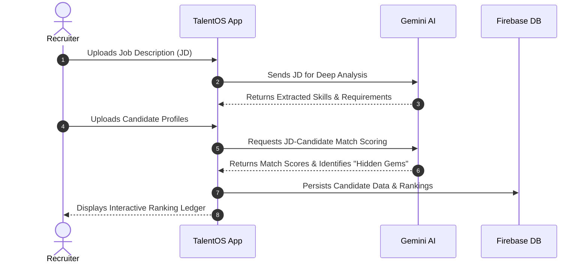

<div align="center">
  <h1>🚀 TalentOS</h1>
  <p><strong>A next-generation, AI-powered talent management and recruiting operating system.</strong></p>
  
  <p>
    
    
    
    
    
    
  </p>
</div>

<br />

## 🌟 Overview

**TalentOS** is a modern, high-performance, full-stack talent ranking and discovery platform built specifically for the **India Runs Data and AI Challenge** (Redrob Hackathon). 

It bridges the gap between raw candidate data and actionable recruiting insights by combining a **deterministic, CPU-efficient ranking engine** with a **sleek, animated glassmorphic React dashboard**.

---

## 🔄 Core Workflow

Below is the standard workflow of how TalentOS processes recruitment data to provide intelligent insights:



---

## 🏗️ System Architecture & Components

The platform is designed with a clear separation of concerns, split into a backend evaluation engine and a frontend visualization dashboard.

### 1. The Ranking Engine (`rank.cjs` & `rank.py`)
The core of TalentOS is its deterministic ranking script. It reads from a raw `candidates.jsonl` file, applies a multi-signal scoring model, and outputs a `submission.csv` containing the top 100 candidates.

**Why deterministic?**
To ensure fairness, reproducibility, and high performance (~45 seconds for 100,000 candidates), the scoring does not use external LLMs. Instead, it uses heavily tuned heuristics.

#### 🧠 The Scoring Model
Candidates are evaluated on three primary axes:
* **Experience (30% Weight):**
  * Evaluates total Years of Experience (YoE) with a sweet spot between 6-8 years. Diminishing returns are applied after 12 years.
  * **Penalty:** Candidates whose *entire* career is at consulting firms (e.g., TCS, Infosys, Wipro, Accenture) receive severe penalties if they lack core product-company experience.
  * **Bonus:** Explicit Machine Learning, AI, or Information Retrieval job titles and descriptions receive significant boosts.
* **Skills Density (45% Weight):**
  * **Required Skills:** Evaluates against canonical skill groups like Vector Databases (Pinecone, Weaviate, Milvus) and Embeddings (sentence-transformers, semantic-search).
  * **Desired Skills:** Looks for advanced LLM concepts (LoRA, PEFT, Fine-tuning) and Learning-to-Rank (XGBoost).
  * **Domain Mismatch Penalty:** Catching keyword stuffers—if a candidate lists Computer Vision skills but lacks NLP/IR skills, their score is slashed by 50%.
* **Behavioral Signals (25% Weight):**
  * **Location:** Preference given to candidates in major Indian tech hubs (Pune, Noida, Bangalore, Hyderabad).
  * **Availability:** Short notice periods (≤ 30 days) are rewarded; long notice periods (≥ 90 days) are penalized.
  * **Activity:** Rewards high recruiter response rates and recent platform activity.

#### 🛑 Honeypot & Fraud Detection
Before scoring, candidates are scrubbed through a strict filter:
- **Zero-Duration Skills:** Any skill listed with 0 months of duration immediately disqualifies the candidate.
- **Timeline Impossibility:** If the sum of their career history durations heavily mismatches their claimed total years of experience (margin > 0.5 years).
- **Time Travelers:** Certifications dated after 2026.
- **Irrelevant Roles:** Primary job titles in Marketing, Sales, HR, or Accounting are discarded.

---

### 2. The Frontend Application (`src/`)

The recruiter-facing dashboard is built using **React 18**, **Vite**, and **Tailwind CSS**. It provides a window into the data generated by the ranking engine.

#### 🗺️ Key Views & Routes
- **`/` (Landing Page):** An immersive welcome screen introducing the platform's capabilities with a 3D video background and glassmorphism.
- **`/dashboard` (Dashboard):** High-level metrics, pipeline overview, and quick access to top candidates.
- **`/job-analyzer` (JD Analyzer):** Integrates with `@google/generative-ai` (Gemini API). Recruiters paste raw Job Descriptions, and the AI extracts required archetypes, expected trajectories, and system parameters, creating a mapped `candidate_schema.json`.
- **`/ranking` (Ranking Ledger):** The core tabular view where recruiters can browse the deterministically ranked candidates, view their component scores (Experience, Skills, Behavior), and read the generated reasoning for their rank.
- **`/hidden-gems` (Hidden Gems):** A dedicated view for undervalued candidates. These are candidates who score in the top quartile for actual skills and behavior, but use non-standard terminology that normally fails keyword-based ATS systems.
- **`/shortlists` (Shortlists):** A Kanban-style pipeline view for moving candidates through the interview process.

---

## 🛠️ Project Structure

```text
TalentOS/
├── src/                      # Frontend React application
│   ├── components/           # Reusable UI components & layouts
│   ├── pages/                # Route views (Dashboard, Ranking, etc.)
│   ├── lib/                  # Utilities (Gemini API integration, Firebase)
│   └── App.tsx               # Main routing & layout wrapper
├── rank.py                   # Python version of the ranking engine
├── rank.cjs                  # Node.js version of the ranking engine (Primary)
├── submission_metadata.yaml  # Hackathon submission details & config
├── package.json              # NPM dependencies & scripts
├── tailwind.config.ts        # Styling tokens & theme configuration
└── README.md                 # You are here!
```

---

## 🚀 Getting Started

Follow these instructions to get a copy of the project up and running on your local machine for development and testing purposes.

### Prerequisites
- **Node.js**: Version 18.x or higher is recommended.
- **Python**: Version 3.9+ (Optional, only if you prefer running `rank.py` over `rank.cjs`).

### 1. Installation
Clone the repository and install the frontend dependencies:
```bash
git clone https://github.com/mrigeshkoyande/TalentOS.git
cd TalentOS
npm install
```

### 2. Environment Setup
Create a `.env.local` file in the root directory and populate it with your specific credentials:
```env
# Firebase Configuration
VITE_FIREBASE_API_KEY=your_api_key_here
VITE_FIREBASE_AUTH_DOMAIN=your_project.firebaseapp.com
VITE_FIREBASE_PROJECT_ID=your_project_id
VITE_FIREBASE_STORAGE_BUCKET=your_project.appspot.com
VITE_FIREBASE_MESSAGING_SENDER_ID=your_sender_id
VITE_FIREBASE_APP_ID=your_app_id

# Gemini AI Configuration
VITE_GEMINI_API_KEY=your_gemini_api_key_here
```

### 3. Running the Ranking Engine
You must have a `candidates.jsonl` file in the root directory. To process this file and generate the `submission.csv` (the top 100 ranked candidates):

Using Node.js (Recommended for speed):
```bash
node rank.cjs
```
*(This completes in ~45 seconds for 100k candidates on a standard laptop).*

Using Python:
```bash
python rank.py --candidates candidates.jsonl --out submission.csv
```

### 4. Starting the Frontend
To start the Vite development server:
```bash
npm run dev
```
Navigate to `http://localhost:5173` in your browser.

### 5. Building for Production
To create an optimized production build:
```bash
npm run build
npm run preview
```

---

## 📝 Configuration (`submission_metadata.yaml`)
The project includes a `submission_metadata.yaml` file which contains crucial information regarding the hackathon submission. This includes team details, hardware profiles used during inference, and AI usage declarations (confirming that the scoring mechanism itself does not process data via external LLMs).

---

## 📄 License
This project is licensed under the MIT License.
